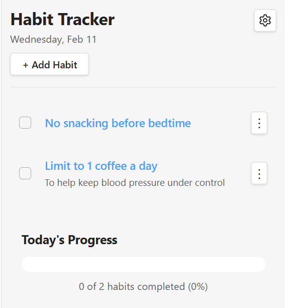
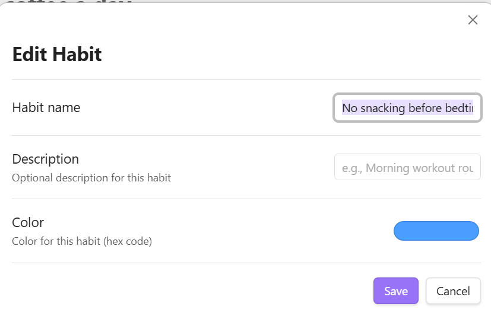
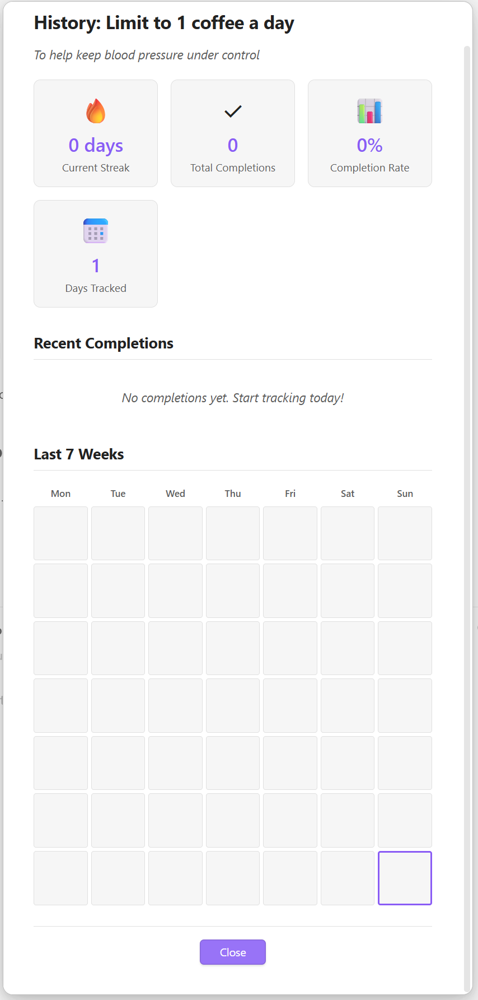
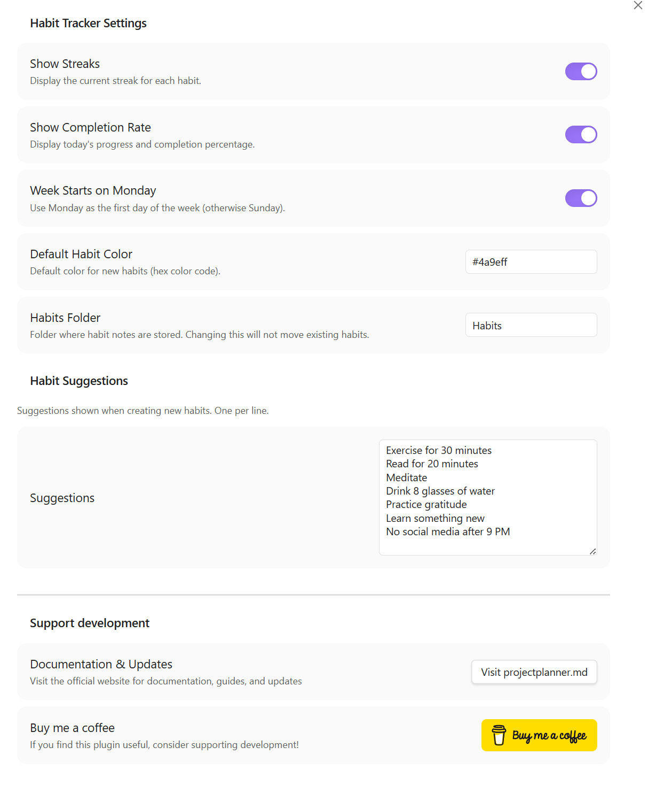

# Habit Tracker for Obsidian

A powerful habit tracking plugin for Obsidian that helps you build and maintain daily habits with streaks, progress tracking, and an intuitive interface. **All your habit data is stored as markdown notes** in your vault for maximum transparency and portability.

## Features

- 📋 **Track Multiple Habits** - Create and manage as many habits as you need
- 📝 **Note-Based Storage** - Each habit is saved as a markdown file you can view and edit
- 🔥 **Streak Tracking** - See how many consecutive days you've maintained each habit
- 📊 **Progress Visualization** - View your daily completion rate with a visual progress bar
- 📅 **Calendar View** - 7-week calendar visualization in the history modal
- 🎨 **Customizable** - Set colors for individual habits and customize your tracking experience
- 💡 **Habit Suggestions** - Get inspiration from built-in suggestions or add your own
- ⚡ **Quick Access** - Ribbon icon and commands for easy access to your habits
- 📂 **Organized** - All habits stored in a dedicated folder (default: `Habits/`)

## How It Works

Each habit is stored as a **markdown note** in your vault with:
- **Frontmatter** containing metadata (ID, color, creation date, etc.)
- **Heading** with the habit name
- **Description** (optional)
- **Completions list** showing all your check-ins with dates

Example habit note (`Habits/Exercise.md`):
```markdown
---
id: 1707734400000-abc123
name: Exercise for 30 minutes
description: Morning workout routine
color: #4a9eff
createdAt: 2026-02-01T08:00:00.000Z
archived: false
---

# Exercise for 30 minutes

Morning workout routine

## Completions

- 2026-02-12 ✓
- 2026-02-11 ✓
- 2026-02-10 ✗
- 2026-02-09 ✓
```

This means you can:
- ✅ View your habits as regular notes
- ✅ Link to habits from other notes
- ✅ Manually edit completions if needed
- ✅ Keep your data in version control
- ✅ Back up habits with your vault

## Screenshots









## Installation

### Manual Installation

1. Download the latest release from the releases page
2. Extract the files into your vault's `.obsidian/plugins/habit-tracker/` directory
3. Reload Obsidian
4. Enable the plugin in Settings → Community Plugins

### From Obsidian (when published)

1. Open Settings → Community Plugins
2. Search for "Habit Tracker"
3. Click Install, then Enable

## Usage

### Opening the Habit Tracker

- Click the check-circle icon in the left ribbon bar
- Use the command palette: `Ctrl/Cmd + P` → "Open Habit Tracker"

### Adding Habits

1. Click the "+ Add Habit" button in the tracker view
2. Enter a name for your habit
3. The habit will appear in your daily list

Alternatively:
- Use the command palette: "Add New Habit"
- Click on suggested habits in the empty state

### Tracking Completion

- Simply check the box next to a habit to mark it complete for today
- Uncheck to mark it incomplete
- Your streak will automatically update

### Managing Habits

Click the ⋮ menu next to any habit to:
- Edit habit details (coming soon)
- Delete the habit
- View completion history (coming soon)

## Settings

Access settings via Settings → Habit Tracker:

- **Show Streaks** - Display current streak for each habit
- **Show Completion Rate** - Show daily progress percentage
- **Week Starts on Monday** - Choose your preferred week start day
- **Default Habit Color** - Set the default color for new habits
- **Habits Folder** - Choose where habit notes are stored (default: `Habits/`)
- **Habit Suggestions** - Customize the list of suggested habits

## Commands

- `Open Habit Tracker` - Opens the habit tracker view
- `Add New Habit` - Quick add a new habit
- `Quick Toggle Habit Completion` - Quickly toggle habit completion

## Tips

1. **Start Small** - Begin with 2-3 habits and build up over time
2. **Be Consistent** - Check your habits at the same time each day
3. **Review Regularly** - Use the completion rate to monitor your progress
4. **Customize** - Use colors to categorize habits (health, work, personal growth)


## Support

If you encounter any issues or have feature requests:
- Create an issue on GitHub
- Reach out to the developer at https://projectplanner.md

## License

MIT License - feel free to use and modify as needed.

## Credits

Developed by @ArctykDev (James Hawkins)

